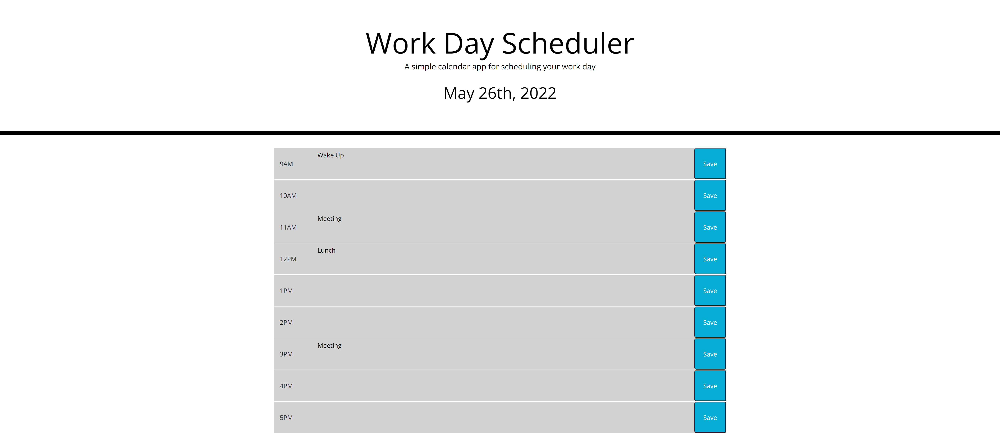

# Third-Party APIs: Work Day Scheduler

## Link
https://connor-kfitz.github.io/blue-bird/

## Description
The purpose of this project is to create a simple event calendar web application.  The calednar will display normal working hours, highlighting previous, current, and future time blocks seperately.  It will also allow the user to add events to each time block, which will be saved even if the page is refreshed.  Lastly, the current date will be displayed at the top of the page.

## Steps Taken
1.  Imported Bootstrap and JavaScript libraries to HTML.

2.  Styled exisiting jumbotron using Bootstrap and created a framework for time blocks.  Added time elements, save buttons, and class & id tags.

3.  Added a few variables to present and track the current date, time, and AM/PM status.

4.  Created a few if statments and for loops to change the background colour of the time blocks, relative to the current time.

5.  Created click listener events for each of the save buttons.  Added functionallity to save the text in local storage.  Went back to start of the code and updated the text of each timeblock with the data saved in the local storage.

6.  Added some minor CSS styling.

## Picture of Website

